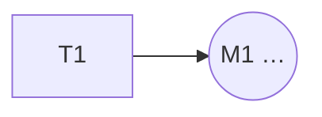

# Projektplan: uppgifter som punkter i en rymd

**Status: förslag (2026-10-02).** Prövas i ett kundprojekt innan den blir standard.

**Beslut 2026-10-03:**
- Uppgifterna följer sin ägare, som allt annat i [repostrukturen](repo-structure.md). Projektets uppgifter ligger i en egen fil, `_progress/plan.md`, inte i design-log. Personens egna ligger hos personen.
- En persons lista är en vy av alla planer, inte en kopia. GTD-kontexterna är dimensionen Var.
- Agenterna i kundprojektet får pröva sig fram fritt med formatet. Konventionen låses först när vi ser vad som håller.

WDS har designlogg (vad som hänt), överlämningar (nästa steg för en agent) och triggerkarta (varför produkten finns). Det som saknats är projektets **uppgifter**: konkreta saker som någon ska göra och som inte hör till en enskild agentsession, till exempel "ring byrån och få åtkomst till repot". Utan en plats hamnar de i chatten och försvinner.

Planen ligger i `_progress/plan.md` i projektet. En plan per projekt.

## Grundidén: varje uppgift är en punkt i en rymd

En uppgift har en koordinat i flera dimensioner. **Varje dimension är ett eget träd**, och en vy är rymden visad som ett träd längs en dimension. Ingen dimension är viktigare än de andra.

| Dimension | Trädet | Exempel |
|---|---|---|
| **Varför** | vision → effektbidrag → respons → åtgärd, eller en princip | mål 2.1, princip S1 |
| **När** | projekt → fas → milstolpe | etapp 1, före M1 |
| **Vad** | område → delområde | video, åtkomst, mätning |
| **Vem** | team → person eller agent | Anna, Wera |
| **Var** | kontext (som i GTD) | @phone, @computer, CMS:et |
| **För vem** | scenario → persona | Bea, internt |
| **Efter** | beroenden: uppgifter som måste vara klara först | T3, T5 |

- En uppgift lagras **platt**, med ett **stabilt id** (T1, T2 …). Inga hierarkiska id:n som 1.5.2, eftersom de gör en dimension viktigast.
- En uppgift kan ha **flera värden** i en dimension, till exempel två mål. Många-till-många är normalfallet.

## Varför: alltid till de definierade målen

**Varför sträcker sig alltid till de definierade målen.** Varje uppgift ger ett effektbidrag till ett mål i triggerkartan (`01-business-goals.md`), eller håller sig inom en princip. Läst uppåt svarar varje nivå på *varför*, nedåt på *hur*.

- **Mål** har riktning och mäts i framsteg ("första sidan i Google på 10 ord").
- **Principer** är som mål, men håller sig inom förutsättningarna. De är aldrig klara och mäts i avvikelser ("noll delade konton").
- **En uppgift utan varför är en signal.** Antingen saknas målet eller principen, eller så behövs inte uppgiften. Agenten frågar.
- **Förutsättningar** (en inloggning, en åtkomst) pekar på en princip och på de uppgifter de låser upp.

### Principer i policyer, på olika nivåer

Principer beskrivs i policydokument. En lägre nivå får skärpa men inte mildra en högre.

| Nivå | Gäller | Plats |
|---|---|---|
| Organisation | alla projekt hos en kund eller avdelning | en gemensam mapp, till exempel `shared/<kund>/governance/` |
| Projekt | ett projekt | projektets mapp |

Varje princip har ett id (S1, S2 …). Policyn har en tabell med avvikelser just nu, och varje avvikelse får en uppgift i planen som pekar tillbaka på principen.

## Milstolpar

En milstolpe är en **beslutspunkt med kunden**, till exempel en redovisning där nästa etapp beslutas. Den får ett id (M1, M2 …) och står i dimensionen När. Redovisningen rapporterar mot de mål som uppgifterna pekar på, inte bara mot leveranserna.

## Formatet

```markdown
- [ ] **T6 Publicera videorna** på porträtten och i sociala medier.
  `varför 2.1, 2.2 · när M1 · vad video · vem Anna · var CMS · för vem alla · efter T4, T5`
```

- Rubrikraden: kryssruta, id och uppgift i fetstil, sedan en kort förklaring.
- Koordinatraden: `dimension värde` åtskilda av `·`. Utelämna dimensioner som inte gäller.
- Valfria rader under: hur, kontaktuppgifter, status ("försök 1 misslyckat"), **Låser upp:** (motsatsen till efter).
- Klara uppgifter flyttas till `### Klart` med datum. De raderas aldrig.
- Inloggningsuppgifter står aldrig i planen. Bara vem som har åtkomst.

## Vyer

Längst ner i planen står vyerna. Agenten uppdaterar dem när uppgifterna ändras.

- **Vem:** uppgifterna per person. En persons nästa steg är samma uppgifter filtrerade på Vem, inte en egen lista.
- **Var:** uppgifterna per kontext. GTD-kontexterna (@phone, @computer) är dimensionen Var.
- **Varför:** uppgifterna per mål och princip.
- **När och beroenden:** ett Mermaid-diagram (`flowchart LR`) med `efter`-pilarna och milstolparna.

## Agenterna

- **Vid start** (`shared-activation.md`): finns `_progress/plan.md`, visa användarens öppna uppgifter (Vem) och de uppgifter som blockerar flest andra (Efter).
- **Under sessionen:** när en ny uppgift dyker upp skriver agenten in den med koordinater direkt, och frågar efter varför om det saknas.
- **Vid wrap** (`wrap.md`): bocka av det som blev klart, lägg till nya uppgifter och uppdatera vyerna.

## Öppet

- **Lagring:** markdown räcker för ett projekt. Med många uppgifter och dimensioner kan YAML i repot eller Design Space bli bättre, med vyerna genererade.
- **Frågor till personer** (`fragor-till-<person>.md`): en egen sorts uppgift, eller en egen fil som i dag?
- **GTD:** ska en persons GTD-listor läsa projektens planer i stället för att ha egna kopior?

## Mall

````markdown
# Plan

Frågor till kunden: [fragor-till-<person>.md](fragor-till-<person>.md).

## Dimensionerna

| Dimension | Värden |
|---|---|
| **Varför** | mål i [triggerkartan](../B-Trigger-Map/01-business-goals.md) eller en princip |
| **När** | etapp 1 · före **M1** (…) · före **M2** (…) · senare |
| **Vad** | … |
| **Vem** | … |
| **Var** | @phone · @computer · … |
| **För vem** | en persona, alla, eller internt |
| **Efter** | uppgifter som måste vara klara först |

## Uppgifterna

### <Område>

- [ ] **T1 <Uppgift>.** <Kort förklaring.>
  `varför … · när … · vad … · vem … · var … · för vem … · efter …`

### Klart

## Vyer

**Vem**
- **<Person>:** T1

**Var**
- **@computer:** T1

**Varför**
- **<Mål>:** T1

**När och beroenden**


````
