# Module 05: Trigger Mapping - NotebookLM Prompt

## Instructions for NotebookLM

Use this prompt to generate an engaging 6-7 minute audio conversation about Trigger Mapping in WDS. The conversation should feel natural, insightful, and practical - like two colleagues discussing a powerful methodology over coffee.

---

## The Prompt

Create a 6-7 minute conversational audio deep dive about Trigger Mapping in Whiteport Design Studio.

**Opening Hook (0:00-0:30)**

"We've all felt that excitement, right? You have a great idea. You're pumped. In your mind, you can already see how wonderful this is going to be. Next step? Let's jump into an AI dialog and make it happen. We can't wait!

But what if we told you there's a way to elevate that idea? To focus your imagination even more? A way to refine and map out exactly how valuable your product is going to be - for yourself, for your organization, and for the end user.

What we're talking about is a single slide that has the power to change how you work with digital products forever. We're talking about the Trigger Map. It's as powerful as it is for a hunter to aim properly before a shot. For a carpenter to measure twice before making a cut. Or for a doctor to diagnose before prescribing.

With Whiteport Design Studio agents, making a Trigger map only this takes a few minutes, and it becomes the backbone of a solid digital strategy. But still, it is so compact that the end result can be easily fit it on a single presentation slide."

**The Big Idea (0:30-1:00)**

"Here's the missing link between strategy and design. Trigger Mapping connects three strategic layers in one visual map:

First layer: Your business goals - what YOU need to achieve. Your vision, your measurable objectives.

Second layer: Your target groups - WHO out there in the world will make sure, with their use of the product, that you achieve YOUR goals. Not just any users - the specific people whose behavior drives your success.

Third layer: Their usage goals - what THEY are trying to achieve. Their psychological drivers - both what they want to accomplish and what they fear or want to avoid. This is THEIR why, not yours.

The magic is in the connection: Your business goals are achieved THROUGH their usage. They use your product to achieve THEIR goals, and in doing so, they help you achieve YOURS. That's the strategic chain. That's why it's called a Trigger Map - you're mapping what triggers them to act in ways that serve your business.

It's not just user research. It's strategic psychology mapped visually so everyone on your team understands this chain from business goal to user motivation to design decision. And it's based on 20+ years of proven methodology, not some new trend."

**The Heritage (1:00-1:30)**

Quick credibility moment: Trigger Mapping is based on Effect Management methodology from inUse in Sweden - created by Mijo Balic and Ingrid Domingues. This approach has been guiding strategic design for over 20 years.

WDS modernized it in three key ways. First, simplified the map by removing features so it stays relevant as your product evolves. Second, added negative driving forces - because research shows people work harder to avoid pain than pursue gain. Third, integrated systematic feature scoring so you can prioritize based on real strategic impact, not opinions.

**The Five Workshops (1:30-4:30)**

This is the heart of the conversation. Walk through each workshop with energy and practical insight:

**Workshop 1: Business Goals (30 seconds)**

"First, you define what winning looks like on TWO levels. Vision - the visionary statement, the aspirational 'why' that motivates your team. Like 'Make remote work sustainable and healthy.' Then you ask the bridging question: 'When this vision is being realized, what will we observe in the world?' That leads to strategic objectives - measurable goals expressed using the SMART method. 'Achieve 5,000 active teams by Q4. Reach 70% retention rate.' Saga guides you through this in 15-20 minutes, connecting aspiration to accountability. This two-level clarity becomes your north star for everything that follows."

**Workshop 2: Target Groups (45 seconds)**

"Now the critical question: WHO out there in the world will make sure, with their use of the product, that you achieve your goals? This isn't about abstract segments - it's about real people whose lives your product will touch. Not demographics like 'parents aged 30-45' but behavioral profiles like 'busy working parents juggling multiple kids' schedules, desperately avoiding family conflict over forgotten responsibilities.' You identify 3-5 groups, create detailed personas, then prioritize ruthlessly. Which group's product usage has the highest impact on your business goals? Which is most feasible to reach? This ranking becomes critical because it determines where you focus your design efforts."

**Workshop 3: Driving Forces (60 seconds)**

"Here's where it gets psychological. For each persona, you map BOTH sides of motivation. Positive drivers - what do they want to achieve? What pulls them forward? And here's the WDS enhancement - negative drivers. What do they want to avoid? What fears push them to act? 

Think about it: A busy parent isn't just seeking 'better organization.' They're desperately avoiding the shame of missing their kid's soccer game. That negative driver - that fear - is often more powerful than any positive benefit. This is loss aversion in action. People work roughly twice as hard to avoid pain as they do to pursue equivalent gain. 

But here's the validation step: Once you've mapped these drivers, you ask the control questions. If this target group feels this way, would our offering be the best option for them? What alternatives do they have? Why should they care in the first place? These questions validate that your drivers actually connect to your product's value proposition. It's a reality check that prevents you from building for the wrong psychology."

**Workshop 4: Prioritization (45 seconds)**

"You can't design for everyone at once. So you prioritize ruthlessly. Which target groups matter most? Which psychological drivers are strongest? This isn't guessing - you're making strategic choices based on business impact and emotional intensity. The output is a ranked list. Your top group's top drivers become your design focus. Everything else is secondary."

**Workshop 5: Feature Impact (60 seconds)**

"Now comes the magic. You take your feature ideas and score them systematically against your prioritized drivers. Each feature gets rated on a 0-3 scale: How well does it address the top psychological drivers? You do this for each feature against each top driver, then sum the scores. 

The math is simple but the insight is profound. You end up with a scored feature list where every number traces back through psychological drivers, to target groups, to business goals. No more random feature requests. No more stakeholder opinion battles. Every design decision is backed by strategic data."

**The Visual Map (4:30-5:00)**

"The Trigger Map itself is beautifully simple. Business goals at the center. Target groups radiating out, ranked by priority. Their positive and negative drivers connected to each group. It's a one-page strategy document that everyone can understand - stakeholders, developers, designers. 

When someone asks 'why are we building this?' you point to the map. The answer is right there. This feature addresses this psychological driver, for this target group, which supports this business goal. Traceable reasoning. Strategic clarity."

**The Workflow Integration (5:00-5:30)**

"And here's what makes WDS different from traditional user research: you have flexibility in how you work. You can do this solo with Saga in your IDE through structured conversation - perfect for individual designers or remote teams. Or you can run it as a physical team workshop with a whiteboard, then upload a photo of your sketch to Saga who will digitize and structure it for you.

Either way, it all happens in your IDE, right alongside your code and design files. Your answers become living documents that feed directly into the next phase. No separate research tools. No lost context. No copying and pasting between systems. Everything builds on everything. Your Product Brief informs your Trigger Map. Your Trigger Map guides your scenarios. Your scenarios drive your design. It's one continuous strategic thread."

**The Value Proposition (5:30-6:30)**

Bring it home with the core benefits:

"So what do you get for 60-90 minutes of strategic work? First, you stop guessing. Every design decision is backed by mapped psychology and business strategy. Second, you get team alignment. Everyone sees the same strategic picture. No more endless debates about priorities.

Third, you get systematic feature prioritization. That scored feature list becomes your roadmap, and it's defensible. When stakeholders ask why you're not building their pet feature, you can show them: here's our Trigger Map, here are our top drivers, here's how features score against them. Your feature scores lower. It's not personal - it's strategic.

Fourth, you get traceable reasoning. Every feature connects to a psychological driver, every driver connects to a target group, every group connects to a business goal. No orphaned features. No random requests. Strategic clarity from top to bottom.

And finally, you get a long-term reference document. The Trigger Map doesn't become outdated when features change. It stays relevant because it focuses on strategy, not implementation. Update it when your business goals shift or you learn new user psychology. But it's not something you're constantly maintaining."

**Three Approaches for Different Situations (6:30-7:00)**

"Now, WDS recognizes that you're not always starting from scratch. You might be in different situations, so we offer three approaches to Trigger Mapping.

First, the full process we just covered - starting from scratch. Sixty to ninety minutes, five workshops, comprehensive strategic foundation. Perfect when you have no existing documentation and need to build everything from the ground up.

Second, what if you already have documentation? Vision docs, user research, interview transcripts, project plans - maybe hundreds of pages gathering dust that nobody actually reads? That's where Documentation Synthesis comes in. Thirty to forty-five minutes. Saga analyzes your documentation, validates what's there, fills gaps through conversation, and transforms it all into a single-slide Trigger Map you can actually use. No more pasting 200 pages into AI chats. No more research reports nobody reads. One actionable strategic artifact.

Third, what if you're in a real hurry? What if you need strategic guidance but don't have even 30 minutes? That's the Value Trigger Chain - or VTC. Fifteen to twenty minutes. You pick ONE strategic objective, identify ONE target group, map ONE key driver - typically negative, because that's often most powerful. One clear chain from business goal to user psychology to design decision. Quick strategic validation when time is tight.

Think of it like this: Full Trigger Mapping is your comprehensive foundation for major products. Documentation Synthesis transforms existing research into actionable strategy. The Value Trigger Chain is your quick strategic check for focused features. All three are based on the same proven methodology. All three give you traceable reasoning. You just choose the approach that fits your situation."

**The Closing (7:00-7:10)**

"So whether you have 90 minutes to build from scratch, 30 minutes to synthesize existing documentation, or 15 minutes for quick validation, you have the tools to stop guessing and start knowing. This is 20 years of proven methodology, modernized and AI-guided for how we work today.

Stop guessing. Start mapping."

---

## Key Messaging Themes

**Heritage & Credibility:**
- 20+ years of Effect Management methodology
- Created by pioneers at inUse, Sweden
- Battle-tested, not experimental
- WDS modernization makes it better

**The Psychology Angle:**
- Both positive AND negative drivers
- Loss aversion principle (pain > gain)
- Emotional intensity matters
- Real human psychology, not surface wants

**The Strategic Value:**
- Three-layer strategic chain (your goals → their usage → their psychology)
- Visual one-page reference showing all connections
- Systematic feature scoring
- Traceable reasoning for every decision

**The WDS Advantage:**
- AI-guided through Saga
- Solo conversation or team whiteboard workshop
- Happens in your IDE
- Integrated workflow
- Living strategic document

**The Practical Payoff:**
- 90 minutes saves months
- Stop guessing, start knowing
- Team alignment
- Defensible priorities

---

## Visual Example: Simplified Trigger Map

Here's a simplified Trigger Map structure to help explain the visual layout:

```mermaid
graph LR
    BG1["<b>BUSINESS GOAL 1</b><br/><br/>Visionary Statement 1<br/><br/><b>Strategic Objectives:</b><br/>• Strategic Objective 1<br/>• Strategic Objective 2<br/>• Strategic Objective 3"]
    
    BG2["<b>BUSINESS GOAL 2</b><br/><br/>Visionary Statement 2<br/><br/><b>Strategic Objectives:</b><br/>• Strategic Objective 1<br/>• Strategic Objective 2<br/>• Strategic Objective 3"]
    
    PRODUCT["<b>Product/Solution Name</b>"]
    
    TG1["👥 <b>Primary Target Group</b>"]
    
    TG2["👤 <b>Secondary Target Group</b>"]
    
    POS1["<b>✅ POSITIVE DRIVERS:</b><br/>• Positive Usage Goal 1<br/>• Positive Usage Goal 2"]
    
    NEG1["<b>❌ NEGATIVE DRIVERS:</b><br/>• Negative Usage Goal 1<br/>• Negative Usage Goal 2"]
    
    POS2["<b>✅ POSITIVE DRIVERS:</b><br/>• Positive Usage Goal 1<br/>• Positive Usage Goal 2"]
    
    NEG2["<b>❌ NEGATIVE DRIVERS:</b><br/>• Negative Usage Goal 1<br/>• Negative Usage Goal 2"]
    
    BG1 --> PRODUCT
    BG2 --> PRODUCT
    PRODUCT --> TG1
    PRODUCT --> TG2
    TG1 --> POS1
    TG1 --> NEG1
    TG2 --> POS2
    TG2 --> NEG2
    
    style BG1 fill:#e3f2fd,stroke:#1976d2,stroke-width:3px
    style BG2 fill:#e3f2fd,stroke:#1976d2,stroke-width:3px
    style PRODUCT fill:#fff9c4,stroke:#f57f17,stroke-width:3px
    style TG1 fill:#fff3e0,stroke:#f57c00,stroke-width:2px
    style TG2 fill:#fff3e0,stroke:#f57c00,stroke-width:2px
    style POS1 fill:#e8f5e9,stroke:#2e7d32,stroke-width:2px
    style NEG1 fill:#ffebee,stroke:#c62828,stroke-width:2px
    style POS2 fill:#e8f5e9,stroke:#2e7d32,stroke-width:2px
    style NEG2 fill:#ffebee,stroke:#c62828,stroke-width:2px
```

**Key Visual Elements:**
- **Left (Blue):** Business Goals with vision statements and measurable SMART objectives
- **Center (Yellow):** The Product/Solution being built
- **Middle (Orange):** Target Groups radiating from the product, with priority indicators (👥 primary, 👤 secondary)
- **Right (Green/Red):** Usage Goals separated into positive drivers (✅ green - what they want) and negative drivers (❌ red - what they fear)
- **Arrows:** Show the strategic chain - business goals → product → target groups → their psychological drivers (both positive and negative)

This one-page map makes the entire strategy visible and accessible to everyone on the team.

---

## How Teams Use the Trigger Map

**The Trigger Map isn't just created once - it's referenced throughout the entire product lifecycle:**

### During Strategic Work
- **Workshop clarifies thinking** - Forces teams to articulate assumptions about users
- **Builds deep empathy** - Goes beyond demographics to understand psychological drivers
- **Creates shared understanding** - Everyone aligned on who matters and why
- **Establishes user starting point** - Where users are when they begin their journey

### For Product Decisions
- **Feature prioritization** - Systematic scoring against top drivers (not opinions)
- **Scope negotiations** - Defend what's in/out with strategic rationale
- **Roadmap planning** - Sequence features by impact on priority drivers
- **MVP definition** - Build what addresses the most important drivers first

### In Design & UX
- **Scenario creation** - Design realistic user journeys based on actual drivers
- **Content writing** - Messaging that speaks to positive desires and negative fears
- **Page-level features** - What functionality serves which drivers
- **Navigation design** - Paths that help users achieve their goals

### For Marketing & Sales
- **Value proposition** - Messaging that addresses top psychological drivers
- **Landing page structure** - Sections targeting specific personas and their drivers
- **Ad copy** - Speak directly to what users want and what they fear
- **Sales enablement** - Equip teams with driver-based talking points

### Ongoing Management
- **Bug prioritization** - Fix what hurts priority drivers most
- **Stakeholder communication** - One-page visual shows strategic rationale
- **Team alignment** - Resolve debates by referencing the map
- **Validation testing** - Test if your assumptions about drivers are accurate

**The key insight:** This isn't a document you create and file away. It's a living strategic reference that guides every decision from features to marketing to support documentation.

---

## Tone & Style

- **Conversational but authoritative** - You know this works
- **Practical, not academic** - Focus on real benefits
- **Energetic about the psychology** - This is fascinating stuff
- **Confident about the value** - This prevents expensive mistakes
- **Respectful of the heritage** - Standing on giants' shoulders

---

## What to Emphasize

✅ The three-layer connection (YOUR goals → WHO achieves them → THEIR goals)  
✅ The gap between Product Brief and design (the missing link)  
✅ Both positive and negative drivers (the WDS enhancement)  
✅ Systematic scoring (data over opinions)  
✅ Visual one-page map (accessible to everyone)  
✅ 20+ year heritage (proven, not trendy)  
✅ 90 minutes prevents months of waste

---

## What to Avoid

❌ Getting too technical about the methodology  
❌ Spending too long on any one workshop  
❌ Making it sound complicated or academic  
❌ Forgetting to mention the heritage  
❌ Skipping the negative drivers emphasis  
❌ Not connecting to real business value
