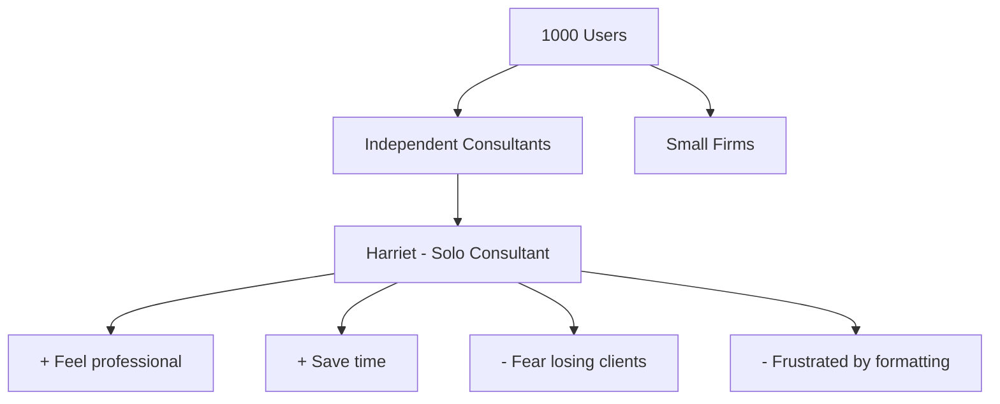

# Saga's Trigger Mapping Guide

**When to load:** During Phase 2 (Trigger Mapping) or when analyzing user psychology

---

## Core Principle

**Connect business goals to user psychology through Trigger Mapping.**

Discover not just WHO your users are, but WHY they act and WHAT triggers their decisions.

---

## What is Trigger Mapping?

**Trigger Mapping is WDS's adaptation of Impact/Effect Mapping** that focuses on user psychology.

**Key differences from generic Impact Mapping:**
- ✅ Removes solutions from the map (solutions designed *against* map, not *on* it)
- ✅ Adds negative driving forces (fears, frustrations) alongside positive ones
- ✅ Focuses on smaller, targeted maps (3-4 user groups max)
- ✅ Integrates explicit prioritization for driving forces

**Result:** Longer shelf life, deeper psychology, clearer focus.

---

## The Trigger Map Structure

**Visual Flow (Left to Right):**

```
Business Goals → Product/Solution → Target Groups → Usage Goals
(Vision +          (What you're      (Who uses it)    (Positive Drivers)
 SMART              building)                          (Negative Drivers)
 Objectives)
```

**Four-Layer Architecture:**

1. **Business Goals** (Left)
   - Vision statement(s) - inspirational direction
   - SMART objectives - measurable targets
   - Multiple goals can feed into the product

2. **Product/Solution** (Center)
   - Product name and description
   - What the product does
   - Central hub connecting goals to users

3. **Target Groups** (Middle-Right)
   - Prioritized personas (Primary 👥, Secondary 👤, etc.)
   - Connected to the product
   - Detailed psychological profiles

4. **Usage Goals** (Right)
   - **Positive Drivers** (✅ green) - What they want to achieve
   - **Negative Drivers** (❌ red) - What they want to avoid
   - Separated into distinct groups per target group
   - Both types are equally important for design decisions

---

## Business Goals Layer

### Vision Goals (Directional)
**"Where are we going?"**

- Build the most trusted proposal platform
- Become the industry standard for consultants
- Revolutionize how professionals communicate value

**Characteristics:**
- Inspirational, not measurable
- Provides direction and purpose
- Guides strategic decisions

---

### SMART Goals (Measurable)
**"How do we know we're making progress?"**

- 1,000 registered users in 12 months
- 500 premium signups in 18 months  
- $50K MRR by end of year 2
- 80% activation rate (signup → first proposal)

**Characteristics:**
- Specific, Measurable, Achievable, Relevant, Time-bound
- Can be tracked objectively
- Tied to business success

---

## Target Groups Layer

**Connect each target group to specific business goals they serve.**

### Example
```
Business Goal: 1,000 registered users
    ↓
Target Groups:
├── Independent consultants (high volume)
├── Small consulting firms (medium volume)
└── Freelance designers (adjacent market)
```

**Why connect:** Shows which users matter most for which goals.

---

## Detailed Personas

**Go beyond demographics → psychological depth**

### Wrong (Shallow)
> "Sarah, 35, consultant, lives in London"

**Why bad:** Doesn't help design decisions

---

### Right (Deep)
> **Harriet the Hairdresser**
> 
> Owns a salon, 15 years experience, ambitious. Wants to be seen as the "queen of beauty" in her town - not just another hairdresser, but THE expert everyone comes to. Fears falling behind competitors who have better online presence. Frustrated by not knowing how to market herself effectively. In her salon context, she's confident. In the digital marketing context, she feels like a beginner.

**Why better:** You can design for her psychology

---

## Usage Goals vs User Goals

**Critical distinction:**

### User Goals (Life Context)
What they want in general life:
- Be a successful consultant
- Provide for family
- Be respected in industry

---

### Usage Goals (Product Context)
What they want when using your product:
- Feel prepared for client meeting
- Look professional to prospects
- Save time on formatting

**Design for usage goals, informed by user goals.**

---

## Context-Dependent Goals

**The Dubai Golf Course Example:**

A golfer using a booking form has specific **usage goals** in that moment:
- Book a tee time quickly
- See availability clearly
- Feel confident about the booking

What they do at the resort restaurant later is a **different context** with different usage goals. Don't conflate them!

**The Harriet Example:**

When booking beauty product supplier:
- **Active goal:** "Compare prices efficiently"
- **Not active:** "Feel like queen of beauty" (that's in salon context)

When marketing her salon online:
- **Active goal:** "Feel like queen of beauty"
- **Not active:** "Compare supplier prices" (different context)

**Design for the active goals in THIS usage context.**

---

## Driving Forces (The Psychology)

### Positive Driving Forces (Wishes/Desires)
**What pulls them forward?**

- Want to feel prepared
- Want to look professional
- Want to impress clients
- Want to save time
- Want to be seen as expert

**Trigger these** through your design and content.

---

### Negative Driving Forces (Fears/Frustrations)
**What pushes them away from current state?**

- Fear looking unprofessional
- Fear losing clients to competitors
- Frustrated by wasted time on formatting
- Anxious about making mistakes
- Worried about missing deadlines

**Address these** through reassurance and solutions.

---

### The Power of Both

**Same goal, different messaging:**

- Positive framing: "Feel confident and prepared"
- Negative framing: "Stop worrying about embarrassing mistakes"

Both are valid! Often negative triggers action faster (pain > pleasure).

---

## Feature Impact Analysis

**Once map is complete, prioritize driving forces:**

### Scoring System (1-5 scale)
- **Frequency:** How often does this trigger matter?
- **Intensity:** How strongly do they feel this?
- **Fit:** How well can our solution address this?

**Example:**
```
"Want to look professional to clients"
├── Frequency: 5 (every proposal)
├── Intensity: 5 (critical to business)
├── Fit: 5 (we solve this directly)
└── Score: 15/15 (HIGH PRIORITY)

"Want to collaborate with team members"
├── Frequency: 2 (solo consultants rarely need this)
├── Intensity: 3 (nice to have)
├── Fit: 3 (requires complex features)
└── Score: 8/15 (LOWER PRIORITY)
```

**Use scores to prioritize features and design decisions.**

---

## Customer Awareness Integration

**Every scenario should move users through awareness stages:**

```
Trigger Map shows:
└── User + Driving Forces

Scenario adds:
├── Starting Awareness: Problem Aware (knows proposals are weak)
└── Target Awareness: Product Aware (knows our solution helps)
```

**Example:**
- **Start:** "I know my proposals lose clients" (Problem Aware)
- **Through scenario:** Experience our solution working
- **End:** "This tool makes my proposals professional" (Product Aware)

---

## Common Trigger Mapping Mistakes

### ❌ Too Many Target Groups
"Let's map 10 different user types..."

**Why bad:** Dilutes focus, overwhelming, unused

**Instead:** 3-4 groups max, deeply understood

---

### ❌ Shallow Personas
"John, 32, works in consulting..."

**Why bad:** Doesn't inform design

**Instead:** Deep psychology, usage context, active goals

---

### ❌ Only Positive Forces
"Users want to save time and be efficient..."

**Why bad:** Missing powerful negative triggers

**Instead:** Positive AND negative (fears drive action!)

---

### ❌ Solutions on the Map
"They need a template library and e-signature..."

**Why bad:** Locks in solutions too early, map ages quickly

**Instead:** Map psychology, design solutions against it

---

### ❌ Generic Goals
"Want a better experience..."

**Why bad:** Too vague to design for

**Instead:** Specific, contextual: "Want to feel prepared before client meeting"

---

## Trigger Map → VTC Connection

**VTC is extracted from Trigger Map:**

```
Trigger Map (Comprehensive):
├── 3 business goals
├── 4 target groups
├── 12 detailed personas
└── 40+ driving forces

VTC (Focused):
├── 1 business goal
├── 1 user/persona
├── 1 solution context
└── 3-5 key driving forces
```

**VTC is the "working copy" for a specific design task.**

---

## Visual Mermaid Diagrams

**Create visual trigger maps using Mermaid syntax:**



**See:** `../../workflows/2-trigger-mapping/mermaid-diagram/`

---

## Workshop Process

**Trigger Mapping is collaborative:**

1. **Define business goals** (Vision + SMART)
2. **Identify target groups** (connect to goals)
3. **Create personas** (psychological depth)
4. **Discover driving forces** (positive + negative)
5. **Prioritize forces** (Feature Impact Analysis)
6. **Generate visual map** (Mermaid diagram)
7. **Document findings** (structured markdown)

**See:** `../../workflows/2-trigger-mapping/workshops/`

---

## When to Update Trigger Map

**Trigger Maps evolve:**

- ✅ New user research reveals different psychology
- ✅ Business goals change
- ✅ New target groups emerge
- ✅ Priorities shift based on data

**Process:**
1. Create new version (v2)
2. Document what changed and why
3. Update any VTCs derived from map
4. Keep old version for reference

---

## Related Resources

- **Phase 2 Workflow:** `../../workflows/2-trigger-mapping/`
- **Impact/Effect Mapping Model:** `../../docs/models/impact-effect-mapping.md`
- **VTC Guide:** `../../docs/method/value-trigger-chain-guide.md`
- **Customer Awareness Cycle:** `../../docs/models/customer-awareness-cycle.md`
- **Feature Impact Analysis:** Prioritization method based on Impact Mapping

---

*Trigger Mapping connects business goals to user psychology. It's the strategic foundation that makes design purposeful.*


