# Trigger Map: WDS Presentation Page

> Visual overview connecting business goals to user psychology

**Created:** December 27, 2025  
**Author:** Mårten Angner with Saga the Analyst  
**Methodology:** Based on Effect Mapping (Balic & Domingues), adapted by WDS

---

## Strategic Visualization

```mermaid
%%{init: {'theme':'base', 'themeVariables': { 'fontFamily':'Inter, system-ui, sans-serif', 'fontSize':'14px'}}}%%
flowchart LR
    %% Business Goals (Left)
    BG0["<br/>⭐ PRIMARY GOAL: 50 EVANGELISTS<br/><br/>THE ENGINE<br/>50 hardcore believers and advocates<br/>Completed course + built real project<br/>Actively sharing and teaching others<br/>Timeline: 12 months<br/><br/>"]
    BG1["<br/>🚀 WDS ADOPTION GOALS<br/><br/>1,000 designers using WDS<br/>100 entrepreneurs embracing<br/>100 developers benefiting<br/>250 active community members<br/>Timeline: 24 months<br/><br/>"]
    BG2["<br/>🌟 COMMUNITY OPPORTUNITIES<br/><br/>10 speaking engagements<br/>20 case studies published<br/>50 testimonials<br/>Client project opportunities<br/>Timeline: 24 months<br/><br/>"]
    
    %% Central Platform
    PLATFORM["<br/>🎨 WHITEPORT DESIGN STUDIO<br/><br/>End-to-End Design Methodology<br/><br/>Transform designers from overwhelmed<br/>task-doers into empowered strategic<br/>leaders who shoulder complexity<br/>as a calling, not a burden<br/><br/>"]
    
    %% Target Groups (Right)
    TG0["<br/>🎯 STINA THE STRATEGIST<br/>PRIMARY TARGET<br/><br/>Designer - Psychology background<br/>Job hunting - Overwhelmed<br/>AI curious but lacks confidence<br/><br/>"]
    TG1["<br/>💼 LARS THE LEADER<br/>SECONDARY TARGET<br/><br/>Entrepreneur - Employee #3<br/>Non-tech founder role<br/>Designer on maternity leave<br/><br/>"]
    TG2["<br/>💻 FELIX THE FULL-STACK<br/>TERTIARY TARGET<br/><br/>Developer - Software engineer<br/>Loves structure - Hates UI<br/>Respects design craft<br/><br/>"]
    
    %% Driving Forces (Far Right)
    DF0["<br/>🎯 STINA'S DRIVERS<br/><br/>WANTS<br/>✅ Be strategic expert<br/>✅ Make real impact<br/>✅ Use AI confidently<br/><br/>FEARS<br/>❌ Being replaced by AI<br/>❌ Wasting time/energy<br/>❌ Being sidelined<br/><br/>"]
    
    DF1["<br/>💼 LARS'S DRIVERS<br/><br/>WANTS<br/>✅ Happy & productive team<br/>✅ Smooth transition<br/>✅ Quality work<br/><br/>FEARS<br/>❌ Quality dropping<br/>❌ Being taken advantage<br/>❌ Team embarrassment<br/><br/>"]
    
    DF2["<br/>💻 FELIX'S DRIVERS<br/><br/>WANTS<br/>✅ Clear specifications<br/>✅ Logical thinking<br/>✅ Enlightened day<br/><br/>FEARS<br/>❌ Illogical designs<br/>❌ Vague specs<br/>❌ Forced UI work<br/><br/>"]
    
    %% Connections
    BG0 --> PLATFORM
    BG1 --> PLATFORM
    BG2 --> PLATFORM
    PLATFORM --> TG0
    PLATFORM --> TG1
    PLATFORM --> TG2
    TG0 --> DF0
    TG1 --> DF1
    TG2 --> DF2

    %% Light Gray Styling with Dark Text + Gold Primary Goal
    classDef primaryGoal fill:#fef3c7,color:#78350f,stroke:#fbbf24,stroke-width:3px
    classDef businessGoal fill:#f3f4f6,color:#1f2937,stroke:#d1d5db,stroke-width:2px
    classDef platform fill:#e5e7eb,color:#111827,stroke:#9ca3af,stroke-width:3px
    classDef targetGroup fill:#f9fafb,color:#1f2937,stroke:#d1d5db,stroke-width:2px
    classDef drivingForces fill:#f3f4f6,color:#1f2937,stroke:#d1d5db,stroke-width:2px
    
    class BG0 primaryGoal
    class BG1,BG2 businessGoal
    class PLATFORM platform
    class TG0,TG1,TG2 targetGroup
    class DF0,DF1,DF2 drivingForces
```

---

## Summary

**Battle Cry:** "Shoulder the complexity, break it down using AI as your co-pilot. Not as a burden, but with excitement. Not as a task, but as a calling!"

**The Flywheel:**
1. ⭐ **Create awesome designers who become evangelists** (THE ENGINE - 12 months)
2. 🚀 **Evangelists drive WDS adoption** (1,000 designers, 100 entrepreneurs, 100 developers, 250 community - 24 months)
3. 🌟 **WDS success creates opportunities for community** (Speaking, case studies, better clients - 24 months)

**Primary Target:** Stina the Strategist - overwhelmed designer becomes empowered strategic leader and evangelist

---

## Detailed Documentation

### Business Strategy

**[01-Business-Goals.md](01-Business-Goals.md)** - Vision, objectives, and success metrics

**Vision:** WDS becomes the guiding light for designers and clients worldwide - empowering designers to thrive in the AI era while delivering exceptional value that drives real product success.

**Priority Tiers:**

1. ⭐ **PRIMARY GOAL: 50 Evangelists** (THE ENGINE - 12 months)
   - Build passionate core of WDS believers who advocate and spread the methodology
   - These 50 drive ALL other objectives - this is the key to expansion

2. 🚀 **WDS Adoption Goals** (24 months)
   - 1,000 designers actively using WDS methodology
   - 100 entrepreneurs embracing WDS for their product development
   - 100 developers benefiting from BMad Method integration
   - 250 active community members

3. 🌟 **Community Opportunities** (24 months)
   - 10 speaking engagements by community members
   - 20 published case studies by members
   - 50 testimonials from community
   - Client project opportunities for WDS-trained designers

---

### Target Users

**[02-Stina-the-Strategist.md](02-Stina-the-Strategist.md)** - Primary target persona

**Profile:** Multi-dimensional designer with psychology background, end of 1-year contract, actively job hunting, overwhelmed and working secret overtime. AI curious but lacks confidence.

**Positive Drivers:**
- ✅ Be the go-to strategic expert - valued and asked for advice
- ✅ Make real impact on the world through grand adventures
- ✅ Confidently use AI professionally and scale her impact

**Negative Drivers:**
- ❌ Being replaced by AI or becoming irrelevant
- ❌ Wasting time/energy on tools that don't work
- ❌ Being sidelined or not valued when she could save the world

**Transformation:** Overwhelmed task-doer → Empowered strategic leader

---

**[03-Lars-the-Leader.md](03-Lars-the-Leader.md)** - Secondary target persona

**Profile:** Seasoned entrepreneur (employee #3, practically founder), not a tech person but plays hybrid PM/CTO role. Designer going on maternity leave - needs stand-in with AI knowledge and drive.

**Positive Drivers:**
- ✅ Team that's happy AND productive (optimized machinery)
- ✅ Smooth designer transition with AI-savvy replacement
- ✅ Quality work that fulfills the vision (willing to pay)

**Negative Drivers:**
- ❌ Quality dropping or bottlenecks (takes very personally)
- ❌ Being taken advantage of by consultants
- ❌ Being embarrassed in front of his team

**Role in Flywheel:** Validates business value, creates demand for WDS designers

---

**[04-Felix-the-Full-Stack.md](04-Felix-the-Full-Stack.md)** - Tertiary target persona

**Profile:** Full-stack developer with straight career path. Loves BMad Method structure and documentation. Respects designers because he's terrible at "GUIs - who even calls it that anymore?"

**Positive Drivers:**
- ✅ Clear, logical specifications that make his life easier
- ✅ Designers who think things through before handing off
- ✅ Work that enlightens his day (not creates problems)

**Negative Drivers:**
- ❌ Illogical designs creating cascading headaches
- ❌ Vague specs forcing him to guess designer's intent
- ❌ Being forced to do UI work he's terrible at

**Role in Flywheel:** Benefits from WDS specs, spreads word about better collaboration

---

### Strategic Implications

**[05-Key-Insights.md](05-Key-Insights.md)** - Design and development priorities

**Primary Development Focus:**
1. Create Awesome Designers Who Become Evangelists - Stina becomes one of the 50
2. Strategic Leadership Transformation - From overwhelmed to empowered
3. AI Confidence Building - Structured, hand-holding path
4. Business Value Validation - Show Lars how WDS delivers results
5. Better Specifications - Prove to Felix that specs reduce headaches

**Critical Success Factors:**
- Emotional Transformation: Burden → Calling
- Hand-Holding Approach: Clear steps, course modules, installation
- Proof of Results: Dog Week case study (5x faster)
- Free Access: No cost barriers
- Complete Journey: Idea → maintenance

**Emotional Transformation Goals:**
- "I can be the strategic leader my team needs"
- "AI amplifies my expertise, doesn't replace it"
- "I have a structured path that works"
- "I'm making real difference through grand adventures"
- "Design is my calling, not just a task"

---

**[06-Feature-Impact.md](06-Feature-Impact.md)** - Prioritized features for UX and development (Optional Design Brief)

**Top Priority Features (Must Have MVP):**
1. Testimonials & Social Proof (Score: 11) 🏆 - ONLY feature scoring HIGH across all three personas
1. BMad Method Integration (Score: 11) 🏆 - All personas benefit from seamless design-to-dev
3. End-to-End Workflow Through Agents (Score: 9) - Complete journey told through expert guides (Saga, Freya, Idunn, Mimir)
3. Conceptual Specifications (Score: 9) - Specs that capture concept + reasoning, making Stina indispensable and Felix happy
5. Example Projects/Case Studies (Score: 8) - Proof that overcomes "wasting time" fear
6. Course Modules (Score: 6) - Hand-holding builds Stina's confidence
7. Installation Documentation (Score: 5) - Removes barrier to entry

**Key Insight:** Agents merged into workflow story - maintains strategic score (9) while creating more engaging, memorable presentation. Characters make abstract methodology human and approachable.

---

## How to Read the Diagram

The trigger map connects business goals (left) through the platform (center) to target user groups (right) and their driving forces (far right).

**Priority:**
- ⭐ **Gold box** = PRIMARY GOAL (50 Evangelists - THE ENGINE)
- 🚀 **Gray boxes** = Supporting goals driven by evangelists
- 🌟 **Gray boxes** = Opportunities created for community members

**Driving Forces:**
- ✅ **Green checkmarks** = Positive goals (what users want)
- ❌ **Red X marks** = Negative goals (what users fear/avoid)

---

_Generated by Whiteport Design Studio_  
_Trigger Mapping methodology credits: Effect Mapping by Mijo Balic & Ingrid Domingues (inUse), adapted with negative driving forces by WDS_

