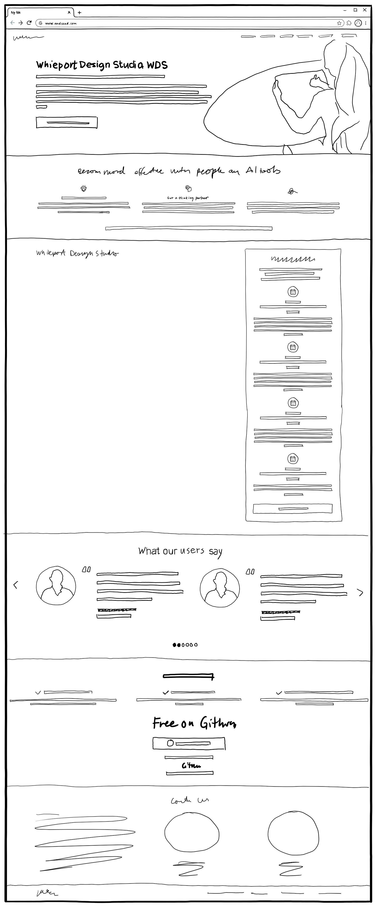

### 1.1 WDS Presentation



# 1.1 WDS Presentation

The WDS Presentation page serves as the primary entry point for designers discovering WDS for the first time. This page addresses the universal pain point of feeling threatened and overwhelmed by AI while promising the emotional transformation to empowered strategic leadership. The page must convert curious visitors into engaged learners by demonstrating immediate value and removing adoption barriers.

**User Situation**: Stina the Strategist, a designer feeling overwhelmed by AI disruption, job hunting, AI-curious but lacking confidence. She's skeptical but hopeful - doesn't want to waste time on another tool. Needs quick value assessment: "Is this worth my time?"

**Page Purpose**: Convert visitors into learners/users by addressing core emotional drivers from the trigger map - eliminating overwhelm while building confidence that designers can thrive (not just survive) in the AI era through structured methodology and strategic leadership.

---

## Reference Materials

**Strategic Foundation:**
- [Product Brief](../../1-project-brief/01-product-brief.md)
- [Content Strategy](../../1-project-brief/02-content-strategy.md) - Messaging guidelines and tone
- [Trigger Map](../../2-trigger-map/00-trigger-map.md)
- [Stina Persona](../../2-trigger-map/02-Stina-the-Strategist.md)
- [Feature Impact](../../2-trigger-map/06-Feature-Impact.md)

**Design Principles:**
1. **Build confidence, don't overwhelm** - Progressive disclosure
2. **Show tangible value fast** - "You'll create THIS"
3. **Make AI friendly** - Co-pilot language, not replacement
4. **Provide structure** - Clear path forward
5. **Prove credibility** - BMad foundation, real results

**Success Metrics:**
- Engagement: 3+ min time on page, 40%+ scroll to capabilities, 20%+ click GitHub/course
- Conversion: 10%+ click CTA, 5%+ watch Module 01, 2%+ clone repository

---

## Page Sections

### Hero Object
**Purpose**: Capture attention and communicate core value in 5 seconds

**Strategic Rationale:** See [Content Strategy - Hero Section](../../1-project-brief/02-content-strategy.md#hero-section) for messaging decisions and psychology.

#### Main Headline
**OBJECT ID**: `wds-hero-headline`
- **Component**: H1 heading
- **Content:**
  - **EN:** "Whiteport Design Studio (WDS)"
- **Rationale**: Clear, descriptive, directly communicates what the page offers.

#### Positioning Statement / Link
**OBJECT ID**: `wds-hero-positioning`
- **Component**: Body text / Link (styled as emphasis text)
- **Content:**
  - **EN:** "A Free and open source design workflow for designers who wants to build what matters!."
- **Rationale**: 
  - Clearly differentiates WDS from quick prototyping tools
  - Addresses the "serious work" positioning
  - Sets expectation that this is for production-ready work
  - Appeals to designers ready to move beyond experimentation

#### Hero Body Copy
**OBJECT ID**: `wds-hero-body`
- **Component**: Body text paragraph
- **Content (What & How - Shorter):**
  - **EN:** "WDS gives you expert AI agents who guide you through strategy and design process to make impactful deliveries for Development with AI or a physical team. WDS places the design in the center of the process and your design thinking becomes the prompts that is building the product!"
- **Alternative (Even Shorter):**
  - **EN:** "Expert AI agents guide you through strategy and design. Your creative work becomes conceptual specifications that preserve your thinking and guide product development."
- **Rationale**: 
  - **What**: Expert AI agents, conceptual specifications, strategic deliverables
  - **How**: Agents guide you → you create specs → specs guide development
  - Shorter than current version, more focused on core value
  - Connects to the agents and specifications themes throughout the page

#### Primary CTA Button
**OBJECT ID**: `wds-hero-cta`
- **Component**: Body paragraph (removed from hero section)
- **Content:**
  - **EN:** [Not included in hero area of final page layout]
- **Note**: CTA moved to bottom of page as standalone section

---

### Benefits Section
**Purpose**: Quickly grasp the three key differentiators

**Strategic Rationale:** This section appears right after the hero to immediately answer "Why WDS?" before diving into methodology. Should reinforce the positioning from hero (not prototyping, but production-ready workflow).

#### Content Block: Three Key Benefits

**Headline Field:**
- **Content (EN):** "Why WDS? Because Designers Matter"

**Teaser Field:**
- **Content (EN):** "WDS brings strategic design thinking practices together with AI agent technology in a free and open source framework."

**Content Field:**
```html
<div style="display: grid; grid-template-columns: repeat(3, 1fr); gap: 30px; margin-top: 40px;">
  
  <div>
    <h3>💺 Designers Are Needed More Than Ever</h3>
    <p>In the world of AI, strategic design thinking becomes even more critical. Designers guide decisions and set the course in AI-driven product development. Your expertise in having dialogues with users and stakeholders is invaluable—especially when you let AI amplify your impact.</p>
  </div>
  
  <div>
    <h3>🌟 Brilliant Design Is Not a Coincidence</h3>
    <p>Great design happens when strategy, user needs, and business goals align. It's a thoughtful, collaborative process that brings teams together around shared vision. WDS agents are trained to amplify the skills and experience of the designer—not drown the process.</p>
  </div>
  
  <div>
    <h3>🚀 The Design Specification Is the New Code</h3>
    <p>AI is awesome at generating code but struggles to change the code it made. This shifts how we work. Your design documentation becomes the source of truth—replacing months of senseless prompting with strategic specifications that guide development.</p>
  </div>
  
</div>

<p style="text-align: center; margin-top: 40px;">
<a href="#">WDS is built on 25+ years of CX/UX/UI design experience by Mårten Angner. Part of the BMad Method for AI agent-driven development.</a>
</p>


```

```

**Alternative Benefits (More aligned with "production-ready" positioning):**

**Option 1: Production-Focused Benefits**
```html
<div>
  <h3>🎯 Strategy Before Design</h3>
  <p>Start with alignment and project briefs. Build on solid strategic foundation. No jumping straight to pixels. WDS ensures you understand the problem before solving it.</p>
</div>

<div>
  <h3>📋 Specifications That Preserve Intent</h3>
  <p>Your design thinking becomes conceptual specifications that guide development. AI generates code from your specs—clean, consistent, production-ready. Your design work is the source of truth.</p>
</div>

<div>
  <h3>🚀 From Idea to Production</h3>
  <p>Complete workflow from stakeholder alignment to handoff. Not just prototyping—actual product development. WDS takes over when you're done experimenting and ready to build what matters.</p>
</div>
```

**Option 2: Workflow-Focused Benefits**
```html
<div>
  <h3>🎯 Complete Workflow, Not Just Tools</h3>
  <p>WDS covers the entire journey: alignment, strategy, design, and handoff. Not another prototyping tool—a complete methodology for building real products.</p>
</div>

<div>
  <h3>📋 Strategic Specifications</h3>
  <p>Your design becomes conceptual specifications that preserve your thinking. These specs guide development and become the source of truth for your product.</p>
</div>

<div>
  <h3>🤝 AI Agents as Co-Pilots</h3>
  <p>Expert AI agents (Saga, Freya, Idunn, Mimir) guide you through each phase. They amplify your expertise, not replace your thinking.</p>
</div>
```

**Rationale**: Three benefits that address universal truths designers can agree on, focusing on how designers wish to feel rather than describing features or solutions.

---

### BMad Integration Section
**Purpose**: Establish credibility and position WDS as the designer's strategic module within proven methodology

**Strategic Rationale:** See [Content Strategy - BMad Integration](../../1-project-brief/02-content-strategy.md#bmad-integration) for messaging decisions and psychology.

#### Content Block: BMad Integration

**Headline Field:**
- **Content (EN):** "A Method That Unites. A Module for Design & Strategy."

**Teaser Field:**
- **Content (EN):** "WDS is an AI Agent framework built on the shoulders of giants. It creates a unified language for entrepreneurs, developers, and designers to collaborate in the AI era. Built from 25 years of UX experience, WDS assists you in strategic design leadership for any digital product from idea to polished product."

**Content Field:**
- **Content (EN):** 
  ```html
  <h3>Your Design Replaces Prompting</h3>
  
  <p>The framework is your thinking partner through the process. It's flexible to suit your needs and is based on solid design practices refined over decades but adapted to the world of AI. You map user psychology and business goals. You envision the user interaction and create conceptual specifications that guide development. You transform vision into strategic design thinking. Entrepreneurs align around your insights. Developers build from your clarity. AI amplifies your expertise. With WDS, you're not just part of the process - you're the strategic center that holds it all together.</p>

  <h3>Powered by BMad Method</h3>
  
  <p>WDS is a module for designers within the BMad Method. Instead of mindless prompting, the BMad method is most effective when run in an IDE (Integrated Development Environment) like Cursor, VS Code, Windsurf, or similar tools.</p>

  <h3>One Chat Leads to the Next</h3>
  
  <p>The Method is built to preserve AI capabilities and divide the creative conversations into dialogs that result in high-level documents. These documents then become the perfect prompts for the next step of the process. Strategy documents become the ideal context for AI to make sound decisions, and dividing the dialog into shorter sessions preserves the AI's memory - the context window.</p>
  
  <h3>Built for Collaboration</h3>
  
  <p>Everything is saved and published for collaboration using GitHub - the same technology developers use for writing code. By moving the design process into the development environment and delivering our design in the perfect form for development, we as designers can deliver far more value than ever before. Regardless if we are stepping up and making the development in our role as designers or if we hand over and collaborate with a development team.</p>
 
  <p>WDS and BMad Method is not just another tool for quick prototyping. WDS takes over when you are done fiddling and ready to build the final product!</p>
  ```

**Rationale**: Three-field structure matches WordPress block editor - Headline provides clear positioning, Teaser introduces core concept and credibility, Content provides detailed explanation with subheadlines

---

### Workflow Through Agents Section
**Purpose**: Make the methodology human and memorable by introducing the expert AI agents who guide each phase

**Strategic Rationale:** See [Content Strategy - Workflow Through Agents](../../1-project-brief/02-content-strategy.md#workflow-through-agents) for messaging decisions and psychology.

#### Content Block: Meet the AI Agents

**Headline Field:**
- **Content (EN):** "Meet the AI Agents"

**Teaser Field:**
- **Content (EN):** "WDS gives you a team of expert AI agents who become your thinking partner through each phase of the design process. Think of them as your strategic co-pilots, each bringing decades of expertise to their specialty. You stay creative and strategic. Named after the Norse Gods, as you summon them, they handle the structure and best practices with superhuman precision. Or adapt to your specific way of working!"

**Content Field:**
```html


<h3>Saga the Analyst — Your Strategic Foundation</h3>

<p>Saga guides you through discovery and strategy. Together, you'll create the Product Brief that defines your vision, business goals, and success criteria. Then Saga helps you build the Trigger Map - connecting what your business needs to what users actually want. Saga asks the right questions so you think deeply about psychology and motivation, not just features.<br>
<a href="https://github.com/whiteport-collective/whiteport-design-studio/blob/main/src/modules/wds/docs/getting-started/agent-activation/wds-saga-analyst.md">Learn more about Saga →</a></p>

<h3>Freya the UX Designer — Your Design Partner</h3>

<p>Freya transforms your strategy into tangible user experiences. She guides you through scenario mapping, page specifications, and conceptual design decisions. Freya helps you articulate not just what the interface looks like, but why you designed it that way. Your design thinking becomes crystal-clear specifications that preserve your strategic intent.<br>
<a href="https://github.com/whiteport-collective/whiteport-design-studio/blob/main/src/modules/wds/docs/getting-started/agent-activation/wds-freya-ux.md">Learn more about Freya</a></p>

<h3>Idunn the Technical Architect — Your Implementation Bridge</h3>

<p>Idunn translates your design vision into technical reality. She guides you through platform architecture, data structures, and system decisions. Idunn ensures your design specifications become actionable PRDs that developers (human or AI) can execute flawlessly. No more lost intent between design and development.<br>
<a href="https://github.com/whiteport-collective/whiteport-design-studio/blob/main/src/modules/wds/docs/getting-started/agent-activation/wds-idunn-pm.md">Learn more about Idunn →</a></p>

<h3>Mimir the Orchestrator — Your Wise Guide</h3>

<p>Mimir sees the big picture. He coordinates your entire journey, ensuring each phase builds on the previous one. When you need perspective on where you are and what comes next, Mimir provides the wisdom. He's your safety net - making sure nothing falls through the cracks as you move from idea to polished product.<br>
<a href="https://github.com/whiteport-collective/whiteport-design-studio/blob/main/src/modules/wds/docs/getting-started/agent-activation/wds-mimir.md">Learn more about Mimir →</a></p>

<h3>Just call their names</h3>

<p>You summon them by just calling their names in the chat and they arrive with their unique capabilities, ready to guide you through their phase of the journey. They hand over tasks so you can start with fresh dialogs and context window as often as you need.</p>
```

**Rationale:** Personal headline invites connection, positions agents as expert partners (not tools), emphasizes collaboration and guidance, connects each agent to deliverables, addresses Stina's need for hand-holding and Lars's need to understand "who does what"

---

### Conceptual Specifications Section
**Purpose**: Explain the core differentiator - specifications that preserve design thinking and prevent spaghetti code

**Strategic Rationale:** See [Content Strategy - Conceptual Specifications](../../1-project-brief/02-content-strategy.md#conceptual-specifications) for messaging decisions and psychology.

#### Content Block: Conceptual Specifications

**Headline Field:**
- **Content (EN):** "Conceptual Specifications: For Designers That Mean Business!"

**Teaser Field:**
- **Content (EN):** "We designers love to sketch, fiddle with, and iterate and refine our designs as our thinking becomes more clear. However, at a certain point, you will be ready to build the final product. this is where the main deliverable in WDS, the Conceptual Specifications comes into the picture. In the world of AI, the specifications matters because AI can only generate consistent code your design is clearly defined!"

**Content Field:**
```html
<h3>Experimentation is Essential</h3>

<p>We love experimentation! Napkin sketches, whiteboard drawings, Figma prototypes, code snippets, inspiration boards, storyboards, pixel art, vibe-coded demos — all of it. This is where creativity happens. This is where ideas mature and refine. The playful creative process reaches a point when experimentation leads to something great, something we want to build and bring to the world.</p>

<h3>Your Designs Are the Perfect Prompt</h3>

<p>When you're ready to move from exploration to production, your creative output has the potential of becoming the blueprint for the whole product - if you give it an effective structure. That's where conceptual specifications come in. When we gather all your experiments in one place, defining them in the right order as user scenarios with step-by-step interaction and clear explanations - not just what you designed, but why you designed it that specific way - you give AI all it needs to make the final product reality.</p>

<h3>The Realization: With AI, the Specification Becomes the New Code</h3>

<p>In the world of AI development, the specifications become the product. The code is just output - generated and regenerated from your design work. Your specifications are the source of truth that gets maintained and refined over time. This is where your strategic thinking lives.</p>

<h3>Design Once, Iterate Forever, Generate When You Need</h3>

<p>The specifications interact closely with your design system to create a coherent experience that grows without limitations. Want to change something? Update the specifications. AI regenerates the code - clean, consistent, and aligned with your design intent. No spaghetti code. No lost reasoning. No painful refactoring. Your design work IS the product.<br>

<a href="https://github.com/whiteport-collective/whiteport-design-studio/blob/main/src/modules/wds/docs/deliverables/page-specifications.md">Learn more about Conceptual Specifications →</a></p>
```

**Rationale:** Addresses the pain point of vibe coding tools and spaghetti code, positions conceptual specifications as the solution for production-ready products, emphasizes coherent growth and maintainability

---

### Learn WDS Section
**Purpose**: Provide structured learning path with video tutorials and lesson links

**Strategic Rationale:** Addresses Stina's need for hand-holding and structured learning (Course Modules Score: 6), removes barriers to adoption

#### Content Block: Learn WDS

**Headline Field:**
- **Content (EN):** "Learn WDS"

**Teaser Field:**
- **Content (EN):** "Master Whiteport Design Studio through our comprehensive video course. Each module includes an introduction video explainer and links to the WDS repo where you find our step-by-step lessons, practical examples, and direct links to detailed documentation. The course is currently under production, new sections will be added over time. "

**Content Field:**
```html
<table style="width: 100%; border-collapse: collapse;">
<tbody>
<tr>
<td style="width: 320px; padding-right: 40px; vertical-align: top;">
<a href="https://www.youtube.com/watch?v=qYPYx01YLUc" target="_blank" rel="noopener noreferrer">

</a>
</td>
<td style="vertical-align: top; padding-left: 20px;">
<h3 style="margin-top: 0;">Module 00: Getting Started with WDS</h3>
<p>Learn the fundamentals of WDS and get your environment set up. This module covers everything you need to know to start your journey with Whiteport Design Studio - from understanding the core concepts to installing the framework and activating your first AI agent.</p>
<ul>
<li><a href="https://github.com/whiteport-collective/whiteport-design-studio/blob/main/src/modules/wds/docs/learn-wds/00-course-overview/00-getting-started-overview.md">Module Introduction</a></li>
<li><a href="https://github.com/whiteport-collective/whiteport-design-studio/blob/main/src/modules/wds/docs/learn-wds/00-course-overview/01-prerequisites.md">Lesson 01: Prerequisites &amp; Setup Requirements</a></li>
<li><a href="https://github.com/whiteport-collective/whiteport-design-studio/blob/main/src/modules/wds/docs/learn-wds/00-course-overview/02-learning-paths.md">Lesson 02: Choose Your Learning Path</a></li>
<li><a href="https://github.com/whiteport-collective/whiteport-design-studio/blob/main/src/modules/wds/docs/learn-wds/00-course-overview/03-support.md">Lesson 03: Getting Support &amp; Community</a></li>
</ul>
</td>
</tr>
</tbody>
</table>

<table style="width: 100%; border-collapse: collapse; margin-top: 30px;">
<tbody>
<tr>
<td style="width: 320px; padding-right: 40px; vertical-align: top;">
<a href="https://www.youtube.com/watch?v=Xhw5JB7mpxw" target="_blank" rel="noopener noreferrer">

</a>
</td>
<td style="vertical-align: top; padding-left: 20px;">
<h3 style="margin-top: 0;">Module 01: Why WDS Matters</h3>
<p>Discover why traditional design-to-development handoffs fail and how WDS transforms the designer's role from task-doer to strategic leader. Learn about the AI revolution in product development and why conceptual specifications are the key to staying relevant.</p>
<ul>
<li><a href="https://github.com/whiteport-collective/whiteport-design-studio/blob/main/src/modules/wds/docs/learn-wds/module-01-why-wds-matters/module-01-overview.md">Module Introduction</a></li>
<li><a href="https://github.com/whiteport-collective/whiteport-design-studio/blob/main/src/modules/wds/docs/learn-wds/module-01-why-wds-matters/lesson-01-the-problem.md">Lesson 01: The Problem - Lost Design Intent</a></li>
<li><a href="https://github.com/whiteport-collective/whiteport-design-studio/blob/main/src/modules/wds/docs/learn-wds/module-01-why-wds-matters/lesson-02-the-solution.md">Lesson 02: The Solution - Conceptual Specifications</a></li>
<li><a href="https://github.com/whiteport-collective/whiteport-design-studio/blob/main/src/modules/wds/docs/learn-wds/module-01-why-wds-matters/lesson-03-the-path-forward.md">Lesson 03: The Path Forward - Your Role in the AI Era</a></li>
</ul>
</td>
</tr>
</tbody>
</table>

<table style="width: 100%; border-collapse: collapse; margin-top: 30px;">
<tbody>
<tr>
<td style="width: 320px; padding-right: 40px; vertical-align: top;">
<a href="https://www.youtube.com/watch?v=tYifpxFVVks" target="_blank" rel="noopener noreferrer">

</a>
</td>
<td style="vertical-align: top; padding-left: 20px;">
<h3 style="margin-top: 0;">Module 02: Installation &amp; Setup</h3>
<p>Get WDS installed and running on your machine. This hands-on module walks you through GitHub setup, IDE configuration, cloning the repository, and activating your first AI agent. By the end, you'll have a fully functional WDS environment ready for your first project.</p>
<ul>
<li><a href="https://github.com/whiteport-collective/whiteport-design-studio/blob/main/src/modules/wds/docs/learn-wds/module-02-installation-setup/module-02-overview.md">Module Introduction</a></li>
<li><a href="https://github.com/whiteport-collective/whiteport-design-studio/blob/main/src/modules/wds/docs/getting-started/installation.md">Lesson 01: GitHub &amp; IDE Setup</a></li>
<li><a href="https://github.com/whiteport-collective/whiteport-design-studio/blob/main/src/modules/wds/docs/getting-started/quick-start.md">Lesson 02: Quick Start Guide</a></li>
</ul>
</td>
</tr>
</tbody>
</table>

<table style="width: 100%; border-collapse: collapse; margin-top: 30px;">
<tbody>
<tr>
<td style="width: 320px; padding-right: 40px; vertical-align: top;">
<a href="https://www.youtube.com/watch?v=TKjOLlU8UCE" target="_blank" rel="noopener noreferrer">

</a>
</td>
<td style="vertical-align: top; padding-left: 20px;">
<h3 style="margin-top: 0;">Module 03: Alignment &amp; Signoff</h3>
<p>Get stakeholders aligned and secure commitment before starting the project. Learn the discovery discipline, create compelling alignment documents, and generate appropriate signoff documents (external contracts or internal signoff). Master the art of understanding before solving.</p>
<ul>
<li><a href="https://github.com/whiteport-collective/whiteport-design-studio/blob/main/src/modules/wds/docs/learn-wds/module-03-alignment-signoff/module-03-overview.md">Module Introduction</a></li>
<li><a href="https://github.com/whiteport-collective/whiteport-design-studio/blob/main/src/modules/wds/docs/learn-wds/module-03-alignment-signoff/lesson-01-understanding-alignment.md">Lesson 01: Understanding Alignment</a></li>
<li><a href="https://github.com/whiteport-collective/whiteport-design-studio/blob/main/src/modules/wds/docs/learn-wds/module-03-alignment-signoff/lesson-02-creating-alignment-document.md">Lesson 02: Creating Your Alignment Document</a></li>
<li><a href="https://github.com/whiteport-collective/whiteport-design-studio/blob/main/src/modules/wds/docs/learn-wds/module-03-alignment-signoff/lesson-03-negotiation-acceptance.md">Lesson 03: Negotiation &amp; Acceptance</a></li>
</ul>
</td>
</tr>
</tbody>
</table>

<table style="width: 100%; border-collapse: collapse; margin-top: 30px;">
<tbody>
<tr>
<td style="width: 320px; padding-right: 40px; vertical-align: top;">
<a href="https://youtu.be/yhKxkuLq1kQ" target="_blank" rel="noopener noreferrer">

</a>
</td>
<td style="vertical-align: top; padding-left: 20px;">
<h3 style="margin-top: 0;">Module 04: Product Brief</h3>
<p>Create your strategic foundation through AI-guided conversation. Learn how the Product Brief becomes the most powerful prompt you'll ever create - stopping AI hallucinations before they start and making your idea better through 30 structured questions. Everything happens in one environment with zero copy-paste chaos.</p>
<ul>
<li><a href="https://github.com/whiteport-collective/whiteport-design-studio/blob/main/src/modules/wds/docs/learn-wds/module-04-product-brief/module-04-overview.md">Module Introduction</a></li>
<li><a href="https://github.com/whiteport-collective/whiteport-design-studio/blob/main/src/modules/wds/docs/learn-wds/module-04-product-brief/tutorial-04.md">Tutorial 04: Creating Your Product Brief with Saga</a></li>
</ul>
</td>
</tr>
</tbody>
</table>

<table style="width: 100%; border-collapse: collapse; margin-top: 30px;">
<tbody>
<tr>
<td style="width: 320px; padding-right: 40px; vertical-align: top;">
<a href="https://youtu.be/xs_cRk-NoJk" target="_blank" rel="noopener noreferrer">

</a>
</td>
<td style="vertical-align: top; padding-left: 20px;">
<h3 style="margin-top: 0;">Module 05: Trigger Mapping</h3>
<p>Connect business goals to user psychology through 5 structured workshops. Learn the proven Effect Management methodology (20+ years heritage), map both positive and negative psychological drivers, and create a visual one-page strategy map. Includes systematic feature scoring for data-driven prioritization.</p>
<ul>
<li><a href="https://github.com/whiteport-collective/whiteport-design-studio/blob/main/src/modules/wds/docs/learn-wds/module-05-trigger-mapping/module-05-overview.md">Module Introduction</a></li>
<li><a href="https://github.com/whiteport-collective/whiteport-design-studio/blob/main/src/modules/wds/docs/learn-wds/module-05-trigger-mapping/lesson-01-missing-link.md">Lesson 01: The Missing Link</a></li>
<li><a href="https://github.com/whiteport-collective/whiteport-design-studio/blob/main/src/modules/wds/docs/learn-wds/module-05-trigger-mapping/lesson-02-heritage-evolution.md">Lesson 02: The Heritage &amp; Evolution</a></li>
<li><a href="https://github.com/whiteport-collective/whiteport-design-studio/blob/main/src/modules/wds/docs/learn-wds/module-05-trigger-mapping/lesson-03-five-workshops-overview.md">Lesson 03: The Five Workshops Overview</a></li>
<li><a href="https://github.com/whiteport-collective/whiteport-design-studio/blob/main/src/modules/wds/docs/learn-wds/module-05-trigger-mapping/lesson-04-workshop-1-business-goals.md">Lesson 04: Workshop 1 - Business Goals</a></li>
<li><a href="https://github.com/whiteport-collective/whiteport-design-studio/blob/main/src/modules/wds/docs/learn-wds/module-05-trigger-mapping/lesson-05-workshop-2-target-groups.md">Lesson 05: Workshop 2 - Target Groups</a></li>
<li><a href="https://github.com/whiteport-collective/whiteport-design-studio/blob/main/src/modules/wds/docs/learn-wds/module-05-trigger-mapping/lesson-06-workshop-3-driving-forces.md">Lesson 06: Workshop 3 - Driving Forces</a></li>
<li><a href="https://github.com/whiteport-collective/whiteport-design-studio/blob/main/src/modules/wds/docs/learn-wds/module-05-trigger-mapping/lesson-07-workshop-4-prioritization.md">Lesson 07: Workshop 4 - Prioritization</a></li>
<li><a href="https://github.com/whiteport-collective/whiteport-design-studio/blob/main/src/modules/wds/docs/learn-wds/module-05-trigger-mapping/lesson-08-workshop-5-feature-impact.md">Lesson 08: Workshop 5 - Feature Impact</a></li>
<li><a href="https://github.com/whiteport-collective/whiteport-design-studio/blob/main/src/modules/wds/docs/learn-wds/module-05-trigger-mapping/lesson-09-positive-negative-drivers.md">Lesson 09: Positive &amp; Negative Drivers</a></li>
<li><a href="https://github.com/whiteport-collective/whiteport-design-studio/blob/main/src/modules/wds/docs/learn-wds/module-05-trigger-mapping/lesson-10-visual-trigger-map.md">Lesson 10: The Visual Trigger Map</a></li>
<li><a href="https://github.com/whiteport-collective/whiteport-design-studio/blob/main/src/modules/wds/docs/learn-wds/module-05-trigger-mapping/lesson-11-feature-impact-scoring.md">Lesson 11: Feature Impact Scoring</a></li>
<li><a href="https://github.com/whiteport-collective/whiteport-design-studio/blob/main/src/modules/wds/docs/learn-wds/module-05-trigger-mapping/tutorial-05.md">Tutorial 05: Creating Your Trigger Map with Saga</a></li>
</ul>
</td>
</tr>
</tbody>
</table>
```

**Rationale:** Six-module structure with video thumbnails (YouTube auto-generates), descriptions, and links to actual lessons. Uses clickable thumbnails linking to YouTube (more reliable than iframes). Provides clear learning path for Stina's hand-holding needs.

---

### WDS Webinars Section
**Purpose**: Provide access to recorded webinars and live sessions

**Strategic Rationale:** Complements the structured course modules with live sessions and deeper dives into specific topics. Offers additional learning opportunities for those who prefer webinar format.

#### Content Block: WDS Webinars

**Headline Field:**
- **Content (EN):** "WDS Webinars"

**Teaser Field:**
- **Content (EN):** "Join our live webinars and watch recorded sessions for deeper insights into WDS methodology, real-world case studies, and Q&A sessions with the WDS team. New webinars are added regularly."

**Content Field:**
```html
<table style="width: 100%; border-collapse: collapse;">
<tbody>
<tr>
<td style="width: 320px; padding-right: 40px; vertical-align: top;">
<a href="https://www.youtube.com/watch?v=i1_aCbricG0" target="_blank" rel="noopener noreferrer">

</a>
</td>
<td style="vertical-align: top; padding-left: 20px;">
<h3 style="margin-top: 0;">WDS Webinar</h3>
<p>Watch our recorded webinars to dive deeper into WDS methodology, see real-world applications, and learn from live Q&A sessions.</p>
</td>
</tr>
</tbody>
</table>
```

**Rationale:** Webinar structure with video thumbnails (YouTube auto-generates), descriptions, and links to recorded sessions. Uses clickable thumbnails linking to YouTube. Additional webinars can be easily added as new table rows.

---

### WDS Capabilities Object (Right Column)
**Purpose**: Show designers what they can accomplish with WDS through actionable phases

**Strategic Rationale:** See [Content Strategy - Capabilities Section](../../1-project-brief/02-content-strategy.md#capabilities-section-right-column) for messaging decisions and psychology.

#### Section Headline
**OBJECT ID**: `wds-capabilities-headline`
- **Component**: H2 heading
- **Content:**
  - **EN:** "What You Will Be Able to Accomplish with WDS"
- **Rationale**: Direct, action-oriented, focuses on designer capability

#### Introduction Text
**OBJECT ID**: `wds-capabilities-intro`
- **Component**: Body paragraph
- **Content:**
  - **EN:** "With the help of the WDS agents you will be able to deliver both strategy and design and utilize your design skills to get a seat at the table."
- **Rationale**: Empowers designers with strategic positioning, emphasizes designs as powerful prompts for development

#### Phase 1: Win Client Buy-In
**OBJECT ID**: `wds-capability-phase-1`
- **Component**: Capability card
- **Icon**: 🎯 (target/presentation)
- **Icon Generation Prompt**: "Create a minimalist icon with a red (#EA345D) circular background and a white geometric icon in the center. The icon shows a stylized presentation board. Style: geometric, flat design, clean lines, professional, matching Whiteport logo aesthetic (white icon on red circle). 1024x1024px, PNG format with transparent background around the circle."
- **Content:**
  - **Title (EN):** "Win Client Buy-In"
  - **Description (EN):** "Present your vision in business language that stakeholders understand. Get everyone aligned on goals, budget, and commitment before you start.<br><b><a href="https://github.com/whiteport-collective/whiteport-design-studio/blob/main/src/modules/wds/docs/deliverables/project-pitch.md">More about the Project Pitch</a></b><br><b><a href="https://github.com/whiteport-collective/whiteport-design-studio/blob/main/src/modules/wds/docs/deliverables/service-agreement.md">More about the Service Agreement</a></b>"

#### Phase 2: Project Clarity & Direction
**OBJECT ID**: `wds-capability-phase-2`
- **Component**: Capability card
- **Icon**: 📋 (clipboard/document)
- **Icon Generation Prompt**: "Create a minimalist icon with a red (#EA345D) circular background and a white geometric icon in the center. The icon shows a stylized compass/north star symbol. Style: geometric, flat design, clean lines, professional, matching Whiteport logo aesthetic (white icon on red circle). 1024x1024px, PNG format with transparent background around the circle."
- **Content:**
  - **Title (EN):** "Project Clarity & Direction"
  - **Description (EN):** "Get crystal clear on what you're building, who it's for, and why it matters. Create a strategic foundation that guides every design decision.<br><b><a href="https://github.com/whiteport-collective/whiteport-design-studio/blob/main/src/modules/wds/docs/deliverables/product-brief.md">More about the Product Brief</a></b>"

#### Phase 3: Map Business Goals & User Needs
**OBJECT ID**: `wds-capability-phase-3`
- **Component**: Capability card
- **Icon**: 🗺️ (map/compass)
- **Icon Generation Prompt**: "Create a minimalist icon with a red (#EA345D) circular background and a white geometric icon in the center. The icon shows a stylized network of connected nodes or a bridge connecting two points, representing mapping and connection. Style: geometric, flat design, clean lines, professional, matching Whiteport logo aesthetic (white icon on red circle). 1024x1024px, PNG format with transparent background around the circle."
- **Content:**
  - **Title (EN):** "Map Business Goals & User Needs"
  - **Description (EN):** "Connect what the business wants to what users actually need. Identify the emotional triggers and pain points that drive behavior and design with psychological insight.<br><b><a href="https://github.com/whiteport-collective/whiteport-design-studio/blob/main/src/modules/wds/docs/deliverables/trigger-map.md">More about the Trigger Map &amp; Personas</a></b>"

#### Phase 4: Architect the Platform
**OBJECT ID**: `wds-capability-phase-4`
- **Component**: Capability card
- **Icon**: 🏗️ (building/architecture)
- **Icon Generation Prompt**: "Create a minimalist icon with a red (#EA345D) circular background and a white geometric icon in the center. The icon shows a stylized foundation or building blocks representing technical foundation. Style: geometric, flat design, clean lines, professional, matching Whiteport logo aesthetic (white icon on red circle). 1024x1024px, PNG format with transparent background around the circle."
- **Content:**
  - **Title (EN):** "Nail Down the Platform Requirements"
  - **Description (EN):** "Define the technical foundation, data structure, and system architecture. Make smart decisions about what to build and how it all fits together seamlessly.<br><b><a href="https://github.com/whiteport-collective/whiteport-design-studio/blob/main/src/modules/wds/docs/deliverables/platform-prd.md">More about the Platform PRD &amp; Architecture</a></b>"

#### Phase 5: Design the Experience
**OBJECT ID**: `wds-capability-phase-5`
- **Component**: Capability card
- **Icon**: 🎨 (palette/design)
- **Icon Generation Prompt**: "Create a minimalist icon with a red (#EA345D) circular background and a white geometric icon in the center. The icon shows a stylized design pen tool or cursor on a canvas/frame, representing UX design. Style: geometric, flat design, clean lines, professional, matching Whiteport logo aesthetic (white icon on red circle). 1024x1024px, PNG format with transparent background around the circle."
- **Content:**
  - **Title (EN):** "Design the Experience"
  - **Description (EN):** "Turn sketches into complete specifications with interactive prototypes. Capture not just what it looks like, but why you designed it that way and preserve your intent.<br><b><a href="https://github.com/whiteport-collective/whiteport-design-studio/blob/main/src/modules/wds/docs/deliverables/page-specifications.md">More about Page Specifications &amp; Prototypes</a></b>"

#### Phase 6: Create Your Design System
**OBJECT ID**: `wds-capability-phase-6`
- **Component**: Capability card
- **Icon**: 🧩 (puzzle pieces/system)
- **Icon Generation Prompt**: "Create a minimalist icon with a red (#EA345D) circular background and a white geometric icon in the center. The icon shows stylized modular components or a grid pattern representing a design system. Style: geometric, flat design, clean lines, professional, matching Whiteport logo aesthetic (white icon on red circle). 1024x1024px, PNG format with transparent background around the circle."
- **Content:**
  - **Title (EN):** "Create Your Design System"
  - **Description (EN):** "Extract reusable components, patterns, and design tokens from your pages. Create consistency across your entire product without starting from scratch every time.<br><b><a href="https://github.com/whiteport-collective/whiteport-design-studio/blob/main/src/modules/wds/docs/deliverables/design-system.md">More about the Component Library &amp; Design Tokens</a></b>"

#### Phase 7: Hand Off to Development
**OBJECT ID**: `wds-capability-phase-7`
- **Component**: Capability card
- **Icon**: 📦 (package/delivery)
- **Icon Generation Prompt**: "Create a minimalist icon with a red (#EA345D) circular background and a white geometric icon in the center. The icon shows a stylized package or box with an arrow indicating transfer/delivery. Style: geometric, flat design, clean lines, professional, matching Whiteport logo aesthetic (white icon on red circle). 1024x1024px, PNG format with transparent background around the circle."
- **Content:**
  - **Title (EN):** "Hand Off to Development"
  - **Description (EN):** "Package organized PRD documents with epics and stories. No more guesswork or lost design intent during implementation with AI or human developers.<br><b><a href="https://github.com/whiteport-collective/whiteport-design-studio/blob/main/src/modules/wds/docs/deliverables/design-delivery-prd.md">More about the Design Delivery PRD</a></b>"

---

### Testimonials Section
**Purpose**: Build trust through social proof

*[To be completed]*

---

### New Capabilities Section
**Purpose**: Invite ongoing community participation and feedback

**Strategic Rationale:** See [Content Strategy - Community Engagement](../../1-project-brief/02-content-strategy.md#community-engagement) for messaging decisions and psychology.

#### Section Headline
**OBJECT ID**: `wds-new-capabilities-headline`
- **Component**: H2 heading
- **Content:**
  - **EN:** "New capabilities"
- **Rationale**: Short, direct, implies continuous improvement

#### Section Body
**OBJECT ID**: `wds-new-capabilities-body`
- **Component**: Body paragraph
- **Content:**
  - **EN:** "We are adding new sections and improvements constantly. Share your insights and feedback and take part in building something great for the future."
- **Rationale**: Inclusive language ("we," "your"), emphasizes community participation, forward-looking

#### Feedback CTA Button
**OBJECT ID**: `wds-feedback-cta`
- **Component**: Button Primary
- **Content:**
  - **EN:** "SHARE YOUR IDEAS & FEEDBACK"
- **Link**: [To be determined - likely GitHub Discussions or feedback form]
- **Rationale**: All caps for emphasis, action-oriented, makes users feel heard

---

### CTA Section
**Purpose**: Remove barriers to action

**Strategic Rationale:** Makes users realize they already have the skills needed, builds confidence, and provides clear next steps.

#### Content Block: Get Started with WDS

**Headline Field:**
- **Content (EN):** "Get Started with WDS"

**Content Field:**
```html
<div style="display: grid; grid-template-columns: repeat(3, 1fr); gap: 30px; margin-top: 40px;">
  
  <div>
    <h3>✓ Build on Your Existing Design Skills</h3>
    <p>You don't need to learn everything from scratch. Your UX/UI skills and design thinking are the foundation—WDS provides the structure and methodology to amplify them.</p>
  </div>
  
  <div>
    <h3>✓ Follow a Complete End-to-End Process</h3>
    <p>From stakeholder alignment to final handoff—one complete workflow. WDS guides you through each phase: strategy, design, and delivery. No gaps, no guesswork.</p>
  </div>
  
  <div>
    <h3>✓ Your Design Becomes the Blueprint</h3>
    <p>Your design documentation becomes the new code. No more lost intent or miscommunication. AI and humans alike will love your detailed deliveries.</p>
  </div>
  
</div>
```

**Rationale**: Three points that build confidence by emphasizing existing skills, provide clear value proposition (complete process), and highlight key differentiator (design as blueprint).

---

### Footer Section
**Purpose**: Additional information and contact

#### Founder Credit / About
**OBJECT ID**: `wds-footer-founder`
- **Component**: Body text / Link
- **Content:**
  - **EN:** "WDS is built on 25+ years of CX/UX/UI design experience by Mårten Angner. Part of the BMad Method for AI agent-driven development."
- **Rationale**: Establishes credibility, connects to founder's expertise, positions WDS within BMad Method

---

**Status:** In Progress (Hero & Capabilities Sections Updated to Match Final Design)  
**Designer:** Freya WDS Designer Agent  
**Created:** December 27, 2025  
**Last Updated:** December 29, 2025  
**Page Name:** 1.1 WDS Presentation
