# Micro Instructions: Generate Mermaid Trigger Map Diagram

**Purpose:** Create visually appealing, professional Mermaid flowchart diagrams for trigger maps

---

## Format Requirements

### 1. Mermaid Configuration
```
%%{init: {'theme':'base', 'themeVariables': { 'fontFamily':'Inter, system-ui, sans-serif', 'fontSize':'14px'}}}%%
```
- Always use Inter/system-ui font
- Set fontSize to 14px
- Use base theme

### 2. Flowchart Direction
```
flowchart LR
```
- Always use left-to-right (LR) direction
- Business goals on left → Platform center → Target groups → Driving forces on right

### 3. Node Content Formatting

**Every node must:**
- Start with `<br/>` for top padding
- End with `<br/><br/>` for bottom padding
- Use `<br/>` for line breaks (not multiple spaces)
- Include emoji at the start of the title

**Example node structure:**
```
NodeID["<br/>🎯 TITLE<br/><br/>Line 1<br/>Line 2<br/>Line 3<br/><br/>"]
```

### 4. Business Goals Nodes (Left Column)

**Structure:**
```
BG1["<br/>🌟 WDS VISION<br/><br/>Point 1<br/>Point 2<br/>Point 3<br/><br/>"]
BG2["<br/>📊 CORE OBJECTIVES<br/><br/>Point 1<br/>Point 2<br/>Point 3<br/><br/>"]
```

**Rules:**
- Use BG0, BG1, BG2, etc. as node IDs
- Include relevant emoji (🌟 for vision, 📊 for objectives, 🚀 for growth, etc.)
- List 3-5 key points per goal
- Keep titles in ALL CAPS

### 5. Platform Node (Center)

**Structure:**
```
PLATFORM["<br/>🎨 PLATFORM NAME<br/><br/>Tagline or category<br/><br/>Transformation statement<br/>that spans multiple lines<br/>describing the core change<br/><br/>"]
```

**Rules:**
- Single node ID: PLATFORM
- Include platform emoji
- Show tagline/category
- Include transformation/value statement
- Break long text into multiple lines

### 6. Target Group Nodes

**Structure:**
```
TG1["<br/>🎯 PERSONA NAME<br/>PRIORITY LEVEL<br/><br/>Trait 1<br/>Trait 2<br/>Trait 3<br/><br/>"]
```

**Rules:**
- Use TG0, TG1, TG2, etc. as node IDs
- Include persona-specific emoji
- Show priority (PRIMARY TARGET, SECONDARY TARGET, etc.)
- List 3-4 key profile traits
- Keep persona name in ALL CAPS

### 7. Driving Forces Nodes

**Structure:**
```
DF1["<br/>🎯 PERSONA'S DRIVERS<br/><br/>WANTS<br/>✅ Positive driver 1<br/>✅ Positive driver 2<br/>✅ Positive driver 3<br/><br/>FEARS<br/>❌ Negative driver 1<br/>❌ Negative driver 2<br/>❌ Negative driver 3<br/><br/>"]
```

**Rules:**
- Use DF0, DF1, DF2, etc. matching TG IDs
- Use same emoji as corresponding persona
- Add "PERSONA'S DRIVERS" in ALL CAPS
- Section headers: "WANTS" and "FEARS" (no emojis on headers)
- ✅ emoji before each positive driver
- ❌ emoji before each negative driver
- Exactly 3 drivers per category (top 3 only)
- Blank line between sections

### 8. Connections

**Required connections:**
```
%% Business Goals to Platform
BG0 --> PLATFORM
BG1 --> PLATFORM
BG2 --> PLATFORM

%% Platform to Target Groups
PLATFORM --> TG0
PLATFORM --> TG1
PLATFORM --> TG2

%% Target Groups to Driving Forces
TG0 --> DF0
TG1 --> DF1
TG2 --> DF2
```

**Rules:**
- All business goals connect to platform
- Platform connects to all target groups
- Each target group connects to its driving forces
- Use simple arrows (-->), no fancy styling

### 9. Styling Classes

**Required classes:**
```css
classDef businessGoal fill:#f3f4f6,color:#1f2937,stroke:#d1d5db,stroke-width:2px
classDef platform fill:#e5e7eb,color:#111827,stroke:#9ca3af,stroke-width:3px
classDef targetGroup fill:#f9fafb,color:#1f2937,stroke:#d1d5db,stroke-width:2px
classDef drivingForces fill:#f3f4f6,color:#1f2937,stroke:#d1d5db,stroke-width:2px
```

**Application:**
```
class BG0,BG1,BG2 businessGoal
class PLATFORM platform
class TG0,TG1,TG2 targetGroup
class DF0,DF1,DF2 drivingForces
```

**Rules:**
- Always use these exact colors (light grays with dark text)
- Business goals: lightest gray (#f3f4f6)
- Platform: medium gray (#e5e7eb) with thicker border (3px)
- Target groups: near white (#f9fafb)
- Driving forces: light gray (#f3f4f6)
- Text color: dark gray (#1f2937 or #111827)
- Borders: light gray (#d1d5db or #9ca3af)

---

## Complete Example Template

```mermaid
%%{init: {'theme':'base', 'themeVariables': { 'fontFamily':'Inter, system-ui, sans-serif', 'fontSize':'14px'}}}%%
flowchart LR
    %% Business Goals
    BG0["<br/>🌟 VISION<br/><br/>Vision statement line 1<br/>Vision statement line 2<br/>Vision statement line 3<br/><br/>"]
    BG1["<br/>📊 OBJECTIVES<br/><br/>Objective 1<br/>Objective 2<br/>Objective 3<br/><br/>"]
    
    %% Platform
    PLATFORM["<br/>🎨 PRODUCT NAME<br/><br/>Product category or tagline<br/><br/>Transformation statement<br/>describing the change<br/><br/>"]
    
    %% Target Groups
    TG0["<br/>🎯 PERSONA ONE<br/>PRIMARY TARGET<br/><br/>Profile trait 1<br/>Profile trait 2<br/>Profile trait 3<br/><br/>"]
    TG1["<br/>💼 PERSONA TWO<br/>SECONDARY TARGET<br/><br/>Profile trait 1<br/>Profile trait 2<br/>Profile trait 3<br/><br/>"]
    
    %% Driving Forces
    DF0["<br/>🎯 PERSONA ONE'S DRIVERS<br/><br/>WANTS<br/>✅ Positive driver 1<br/>✅ Positive driver 2<br/>✅ Positive driver 3<br/><br/>FEARS<br/>❌ Negative driver 1<br/>❌ Negative driver 2<br/>❌ Negative driver 3<br/><br/>"]
    
    DF1["<br/>💼 PERSONA TWO'S DRIVERS<br/><br/>WANTS<br/>✅ Positive driver 1<br/>✅ Positive driver 2<br/>✅ Positive driver 3<br/><br/>FEARS<br/>❌ Negative driver 1<br/>❌ Negative driver 2<br/>❌ Negative driver 3<br/><br/>"]
    
    %% Connections
    BG0 --> PLATFORM
    BG1 --> PLATFORM
    PLATFORM --> TG0
    PLATFORM --> TG1
    TG0 --> DF0
    TG1 --> DF1

    %% Styling
    classDef businessGoal fill:#f3f4f6,color:#1f2937,stroke:#d1d5db,stroke-width:2px
    classDef platform fill:#e5e7eb,color:#111827,stroke:#9ca3af,stroke-width:3px
    classDef targetGroup fill:#f9fafb,color:#1f2937,stroke:#d1d5db,stroke-width:2px
    classDef drivingForces fill:#f3f4f6,color:#1f2937,stroke:#d1d5db,stroke-width:2px
    
    class BG0,BG1 businessGoal
    class PLATFORM platform
    class TG0,TG1 targetGroup
    class DF0,DF1 drivingForces
```



---

## Emoji Selection Guide

### Business Goals
- 🌟 Vision
- 📊 Objectives/Metrics
- 🚀 Growth/Expansion
- 💰 Revenue/Business
- 🤝 Partnerships/Community
- 🎯 Goals/Targets

### Personas
- 🎯 Strategic/Primary personas
- 💼 Business/Leadership personas
- 💻 Technical/Developer personas
- 👥 Team/Group personas
- 🎨 Creative/Designer personas
- 📱 User/Customer personas

### Platform
- 🎨 Design/Creative products
- 💻 Software/Tech products
- 📱 Mobile/App products
- 🛠️ Tools/Utilities
- 📊 Analytics/Data products
- 🤖 AI/Automation products

---

## Quality Checklist

Before finalizing diagram, verify:

- [ ] Mermaid config includes custom font and fontSize
- [ ] All nodes start with `<br/>` and end with `<br/><br/>`
- [ ] All titles are in ALL CAPS
- [ ] Each persona has matching emoji in both TG and DF nodes
- [ ] Exactly 3 positive drivers per persona (with ✅)
- [ ] Exactly 3 negative drivers per persona (with ❌)
- [ ] "WANTS" and "FEARS" headers have no emojis
- [ ] All connections are present (goals→platform→groups→forces)
- [ ] Light gray styling with dark text applied
- [ ] Platform has thicker border (3px)
- [ ] No syntax errors or missing brackets

---

## Common Mistakes to Avoid

❌ **Don't:**
- Use multiple spaces for alignment (use `<br/>` only)
- Mix HTML tags (bold, italic) - keep plain text
- Forget padding (`<br/>`) at top and bottom
- Use colors other than light grays
- Add emojis to "WANTS" and "FEARS" headers
- Include more than 3 drivers per category
- Use lowercase in titles

✅ **Do:**
- Use `<br/>` for all line breaks
- Keep consistent spacing (blank lines between sections)
- Match emojis between personas and their drivers
- Use exactly 3 drivers per category
- Apply consistent styling to all nodes
- Test diagram renders correctly

---

**This format creates professional, scannable trigger maps that clearly communicate strategic insights at a glance.**

